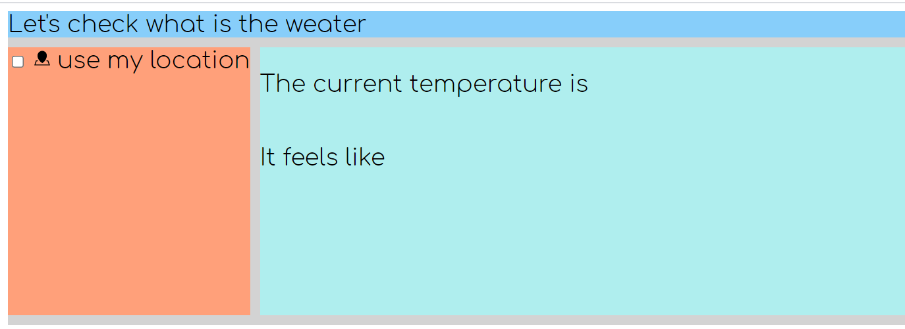
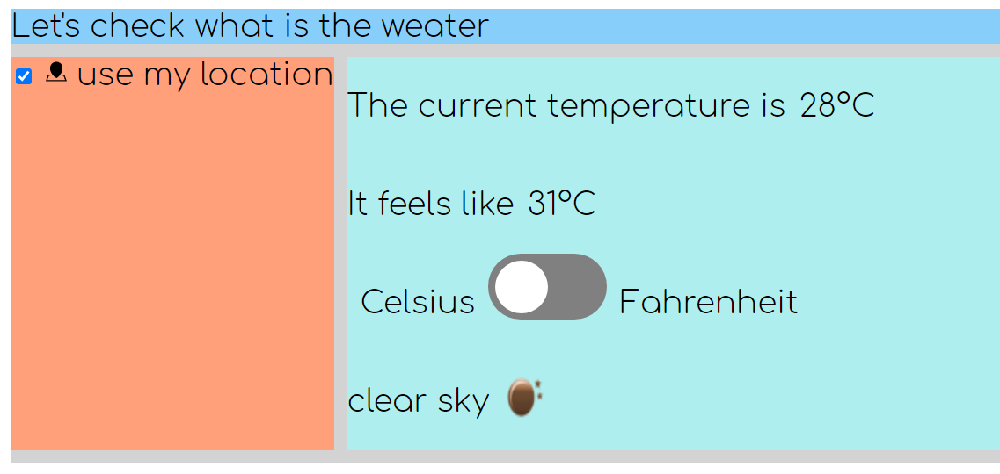
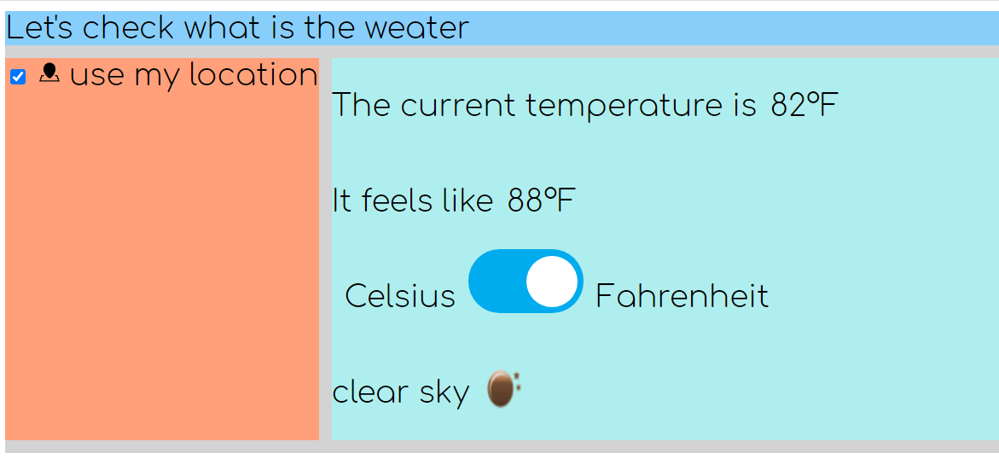

## Website
this project is deployed into github page - https://ariela147.github.io/Local-Weather-website/

## Weather API:

freeCodeCamp Weather API : https://weather-proxy.freecodecamp.rocks/.

this app uses an HTTP Secure connection for the weather

## User Stories :

- [x] I can see the weather in my current location.

- [x] I can see a different icon or background image (e.g. snowy mountain, hot desert) depending on the weather.

- [x] I can push a button to toggle between Fahrenheit and Celsius.

### Advence :

- [x] when cancels the selection to use my current location - hide the tmp.

- [x] I can see how the weather feels like in tmperature

- [x] I can see wind speed

- [x] I can see humidity percentage

- [x] I can see a sum up of the wather - sunny, cloudy, rainy etc.

- [x] fix style of the website

## Screenshots : 

after giving premission for using my location

